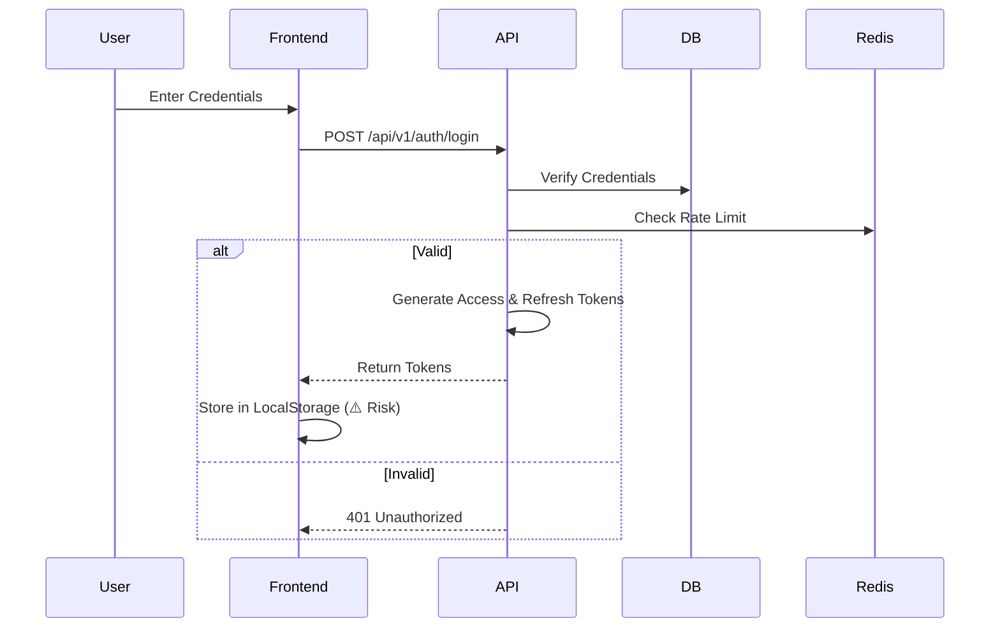
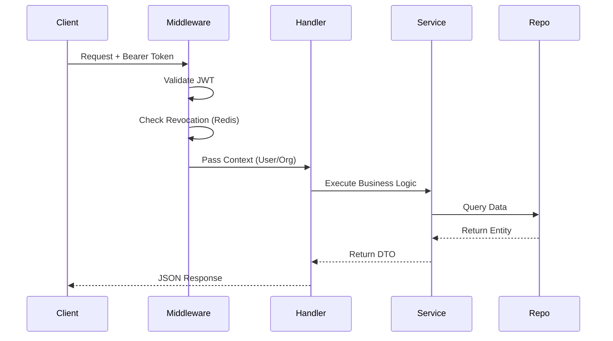

# Production Readiness Review: Auth Service

## A. Architecture Summary

The system follows a **Clean Architecture** pattern with a clear separation of concerns:
-   **Backend (Go):** Built with Gin (HTTP), GORM (PostgreSQL), and Redis. It uses a layered approach: `Handler -> Service -> Repository -> Database`.
-   **Frontend (Next.js):** A modern Next.js 16 App Router application using React 19, Tailwind CSS 4, and Zustand/React Query for state management.
-   **Infrastructure:** Dockerized with multi-stage builds. Observability is built-in with OpenTelemetry (Tracing), Prometheus (Metrics), and structured logging.
-   **Security:** Comprehensive IAM system with RBAC, OAuth2 provider capabilities, granular rate limiting, and secure configuration management.

## B. Feature Inventory

| Feature Category | Feature Name | Status | Key Files |
| :--- | :--- | :--- | :--- |
| **Core Auth** | User Registration | ✅ Ready | `auth_handler.go`, `service/auth_service.go` |
| | Login (Email/Password) | ✅ Ready | `auth_handler.go` |
| | Token Management (JWT) | ✅ Ready | `pkg/jwt`, `middleware/auth_middleware.go` |
| | Password Reset | ✅ Ready | `auth_handler.go`, `service/email_service.go` |
| **Organization** | Create/Manage Org | ✅ Ready | `organization_handler.go`, `models/organization.go` |
| | Member Management | ✅ Ready | `organization_handler.go` |
| | Role Management (RBAC) | ✅ Ready | `role_handler.go`, `rbac_handler.go` |
| | Invitations | ✅ Ready | `organization_handler.go` |
| **OAuth2 Provider** | Authorization Code Flow | ✅ Ready | `oauth2_handler.go`, `oauth2_consent_handler.go` |
| | Client App Management | ✅ Ready | `client_app_handler.go` |
| | Token Introspection/Revocation | ✅ Ready | `revocation_handler.go` |
| **Developer Tools** | API Key Management | ✅ Ready | `api_key_handler.go` |
| **Admin** | User Management | ✅ Ready | `admin_handler.go` |
| | System Stats | ✅ Ready | `admin_handler.go` |
| **Observability** | Health Checks | ✅ Ready | `health_handler.go` |
| | Metrics (Prometheus) | ✅ Ready | `middleware/metrics.go` |
| | Tracing (OpenTelemetry) | ✅ Ready | `middleware/tracing.go` |

## C. Flow Diagram

### Authentication Flow


### Request Flow (Protected)


## D. API Inventory

| Endpoint | Method | Purpose | Concerns |
| :--- | :--- | :--- | :--- |
| `/api/v1/auth/register` | POST | User registration | Rate limit by IP |
| `/api/v1/auth/login` | POST | User login | Rate limit by IP |
| `/api/v1/user/profile` | GET | Get user profile | Auth required |
| `/api/v1/organizations` | GET/POST | Org management | Complex RBAC checks |
| `/api/v1/oauth/authorize` | GET/POST | OAuth2 consent | CSRF protection critical |
| `/api/v1/admin/*` | * | Superadmin actions | Strict auth checks needed |

## E. Strengths

1.  **Robust Observability:** Native integration of OpenTelemetry and Prometheus across HTTP, DB, and Redis layers is excellent for production debugging.
2.  **Granular Security:**
    -   Rate limiting is implemented at multiple levels (IP, User, Email) and scopes (Login, API, Reset).
    -   RBAC is fine-grained with custom permissions per organization.
3.  **Clean Architecture:** The backend code is well-structured, making it easy to test and maintain.
4.  **Configuration Safety:** The `validateConfig` function prevents the application from starting in production with insecure defaults (e.g., weak JWT secrets).
5.  **Modern Frontend:** Uses the latest Next.js features and a solid component library (Radix UI).

## F. Weaknesses / Risks

1.  **Frontend Token Storage (High Risk):** The frontend stores JWTs in `localStorage` (implied by `middleware.ts` comments). This is vulnerable to XSS.
    -   *Mitigation:* Move to HttpOnly cookies for token storage.
2.  **Docker Security (Medium Risk):** The `Dockerfile` runs the application as `root`.
    -   *Mitigation:* Create a non-root user in the Dockerfile.
3.  **Frontend Middleware (Medium Risk):** The Next.js middleware bypasses auth checks for `/user` and `/superadmin`, relying on client-side logic. This can cause content flashes.
    -   *Mitigation:* Implement server-side token validation in middleware or use `next-auth`.
4.  **Database Migrations:** Auto-migration (`repository.Migrate(db)`) is run on startup. In a clustered production environment, this can cause race conditions.
    -   *Mitigation:* Run migrations as a separate init container or CI/CD step.

## G. Actionable TODO List

### MUST FIX (Production Blockers)
- [ ] **Docker:** Update `Dockerfile` to run as a non-root user.
- [ ] **Frontend Auth:** Switch from `localStorage` to HttpOnly cookies for storing access/refresh tokens.
- [ ] **CI/CD:** Ensure `JWT_SECRET` and other sensitive env vars are injected securely (e.g., via K8s Secrets or Vault).

### SHOULD FIX (Important)
- [ ] **Migrations:** Move database migrations out of the application startup path to a separate job.
- [ ] **Frontend Middleware:** Enhance `middleware.ts` to validate tokens (if using cookies) or handle redirects more robustly.
- [ ] **Testing:** Add integration tests for critical flows (Login -> Get Profile).

### NICE TO HAVE (Optional)
- [ ] **API Docs:** Generate Swagger/OpenAPI documentation from the code.
- [ ] **Caching:** Implement response caching for static/semi-static data (e.g., list of permissions).

## H. PR Suggestions

1.  **Refactor Dockerfile:**
    ```dockerfile
    # ... existing build stage ...
    FROM alpine:latest
    RUN adduser -D -g '' appuser
    USER appuser
    # ... rest of file ...
    ```

2.  **Secure Cookie Implementation:**
    -   Update `auth_handler.go` to set `http.Cookie` instead of just returning JSON.
    -   Update frontend API client to read/send cookies automatically.

3.  **Migration Separation:**
    -   Create a separate entry point or flag in `main.go` to run *only* migrations, so it can be called separately.
